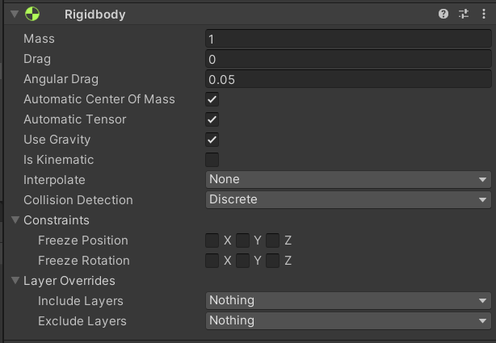
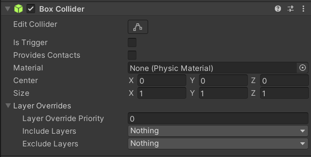
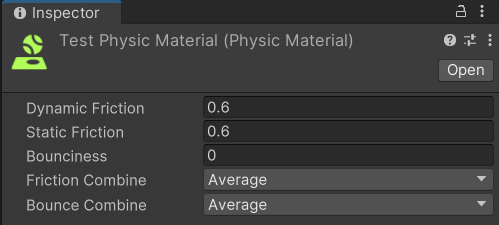

# Основы физики в Unity  

В этом разделе мы рассмотрим ключевые физические компоненты Unity: **Rigidbody**, различные виды **Collider** и **Physics Material**.  

## Напоминание о базовых элементах  

- **Сцена** — файл с расширением `.scene`, содержащий набор объектов Unity.  
- **Transform** — обязательный компонент любого объекта. Определяет:  
  - положение (координаты),  
  - ориентацию (поворот),  
  - размер (масштаб).  

Unity использует **компонентную систему**: каждый объект состоит из набора компонентов.  
Минимальный набор — это `Transform`. Остальные компоненты (визуальные, физические, скриптовые) задают дополнительное поведение объекта.  

### Rigidbody  
Добавляет объекту возможность подчиняться законам физики Unity:  
- падение под действием гравитации,  
- столкновения с другими телами,  
- применение сил и импульсов.  

Без `Rigidbody` объект остаётся "статичным" в физическом смысле: коллайдеры будут реагировать на столкновения, но движение не будет рассчитываться физикой.  

Настройки Rigidbody в инспекторе:

- **Mass** — масса объекта. Влияет на то, как он реагирует на силы и столкновения.  
- **Drag** — линейное сопротивление движению (имитация трения воздуха). Чем выше, тем быстрее объект замедляется.  
- **Angular Drag** — сопротивление вращению. Чем больше значение, тем быстрее вращение останавливается.  

- **Automatic Center Of Mass** — автоматический расчёт центра массы (обычно оставляют включённым).  
- **Automatic Tensor** — автоматический расчёт момента инерции.  

- **Use Gravity** — использовать ли гравитацию Unity. Если выключить, объект не будет падать.  
- **Is Kinematic** — объект перестаёт подчиняться физике и может двигаться только через скрипты/Transform.  

- **Interpolate** — сглаживание движения для плавности при низком FPS:  
  - *None* — без сглаживания.  
  - *Interpolate* — объект «догоняет» прошлое положение.  
  - *Extrapolate* — предсказывает следующее положение.  

- **Collision Detection** — метод обработки столкновений:  
  - *Discrete* — стандартный режим (подходит для медленных объектов).  
  - *Continuous* — лучше для быстрых тел, чтобы не «пролетали» сквозь стены.  
  - *Continuous Dynamic* / *Continuous Speculative* — дополнительные режимы для особо быстрых объектов.  

#### Constraints (ограничения)  
- **Freeze Position (X, Y, Z)** — фиксирует движение по выбранной оси.  
- **Freeze Rotation (X, Y, Z)** — фиксирует вращение по выбранной оси.  

#### Layer Overrides  
- **Include Layers** — слои, с которыми объект *должен* взаимодействовать.  
- **Exclude Layers** — слои, с которыми объект *игнорирует* столкновения.  

### Collider  
Компоненты, описывающие форму объекта для системы столкновений.  
Основные типы:  
- **Box Collider** — прямоугольный объём.  
- **Sphere Collider** — сфера.  
- **Capsule Collider** — капсула, часто используется для персонажей.  
- **Mesh Collider** — повторяет форму 3D-модели.  

Настройки коллайдера в инспекторе на примере Box Collider:

- **Edit Collider** — инструмент ручного редактирования формы коллайдера прямо в сцене.  
- **Is Trigger** — делает коллайдер «триггером»: объект не сталкивается физически, но события пересечения можно отлавливать в скриптах (`OnTriggerEnter`, `OnTriggerExit`).  
- **Provides Contacts** — позволяет получать контактные точки столкновений для скриптов, даже если коллайдер триггерный.  
- **Material** — физический материал (`Physic Material`), определяющий трение и упругость поверхности.  

- **Center (X, Y, Z)** — смещение центра коллайдера относительно объекта.  
- **Size (X, Y, Z)** — размеры коллайдера по осям.  

### Layer Overrides  
- **Layer Override Priority** — приоритет наложения правил взаимодействия слоёв.  
- **Include Layers** — слои, с которыми объект *обязательно* взаимодействует.  
- **Exclude Layers** — слои, с которыми объект *игнорирует* столкновения.  

### Physics Material  

Чтобы создать физический материал, нужно в окне Project нажать правую кнопку мыши => Create => Physic Material.

Настройки физического материала в инспекторе.

Физический материал задаёт свойства поверхности объекта: трение и упругость.  

- **Dynamic Friction** — коэффициент трения при движении. Чем выше значение, тем сильнее объект замедляется при скольжении.  
- **Static Friction** — коэффициент трения покоя. Определяет, насколько трудно сдвинуть объект с места.  
- **Bounciness** — упругость. Чем выше значение, тем сильнее объект отскакивает при столкновении.  

#### Combine Options (режимы комбинирования)  
Эти параметры определяют, как материал объекта взаимодействует с материалом другого объекта при столкновении:  

- **Friction Combine** — способ вычисления трения:  
  - *Average* — среднее значение двух материалов.  
  - *Minimum* — берётся минимальное значение.  
  - *Maximum* — берётся максимальное значение.  
  - *Multiply* — значения перемножаются.  

- **Bounce Combine** — аналогично, но для упругости (Bounciness).    

Используется для создания разных эффектов: скользкий лёд, резиновый мяч, шероховатая поверхность и т. д.